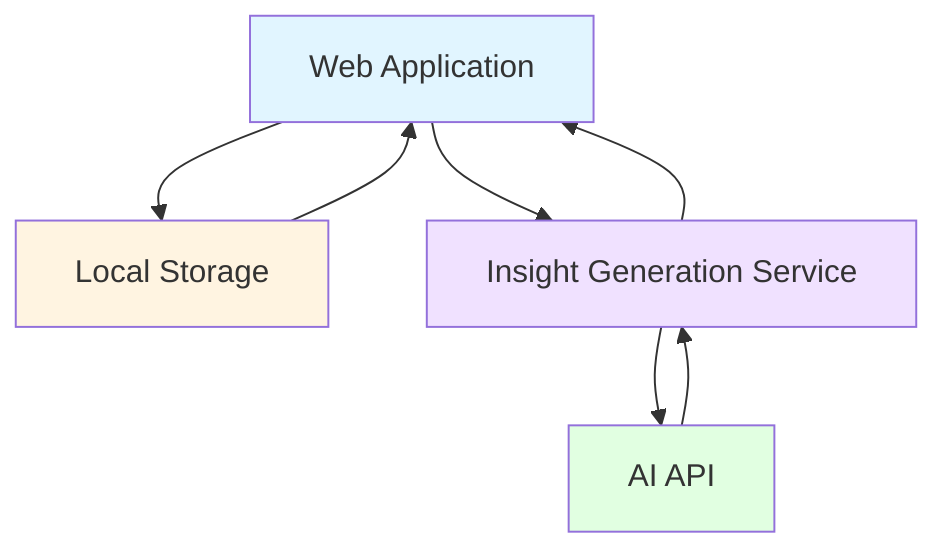

# Daily Pulse: Founder Wellness Check-In

## Description

Enable founders to catch burnout warning signs early through a 60-second daily wellness ritual that reveals mental health patterns.

## Core Value Proposition

- **Early burnout detection**: Founders identify declining mental health patterns 2-4 weeks earlier than without tracking, enabling proactive intervention before crisis
- **Zero friction wellness habit**: 60-second daily check-in removes the barrier of complex tracking tools, increasing completion rate from typical 15% (complex apps) to target 70%+
- **Pattern recognition over noise**: 7-day and 30-day trend visualization reveals meaningful patterns that daily fluctuations hide, helping founders distinguish bad days from dangerous trends
- **Privacy-first approach**: Local data storage eliminates privacy concerns and account friction, removing the #1 barrier founders cite for not using wellness tools
- **Actionable self-awareness**: Human-readable AI insights translate raw data into concrete understanding ("Your energy has dropped 40% over 2 weeks while stress climbed"), enabling better decisions about rest and workload

## Who It's For

**Primary Users:**
- **Solo founders**: Building alone with no team to notice warning signs; need self-awareness tool that doesn't add to their overwhelming task list
- **Early-stage startup founders (pre-Series A)**: Working 60-80 hour weeks in high-stress environment; need quick reality checks to prevent burnout that could derail the company

**Secondary Users:**
- **Founder coaches and therapists**: Can reference client's Daily Pulse trends during sessions to ground conversations in data rather than memory

**Stakeholders:**
- **Accelerators and founder support programs**: Care about founder mental health as predictor of startup success; may recommend Daily Pulse to cohorts
- **Co-founders and partners**: Benefit indirectly when founders catch burnout early and make better decisions about workload and rest

## Jobs to Be Done

1. **When I'm deep in startup execution mode**, I want to maintain basic self-awareness of my mental state, so I can catch declining patterns before they become crises that affect my decision-making and company

2. **When I feel like I might be burning out**, I want to see objective data on my recent trends, so I can distinguish between a bad week and a dangerous pattern requiring action

3. **When I'm deciding whether to push through or take a break**, I want clear insight into my energy and stress patterns, so I can make evidence-based decisions instead of just powering through until I crash

4. **When talking to my coach or therapist**, I want concrete data about my recent mental state, so I can have more productive conversations grounded in patterns rather than fuzzy recollection

## Key Assumptions

**User Behavior:**
- Founders will complete a 60-second check-in daily if it's truly effortless (no login, no complex questions)
- Visual trends are more actionable than raw numbers for non-technical wellness tracking
- Streak counter provides sufficient motivation for habit formation without gamification complexity
- Founders trust local storage more than cloud storage for sensitive wellness data

**Technical:**
- Browser local storage is reliable enough for MVP (acceptable if users occasionally lose data when clearing browser)
- Simple 3-question model captures enough signal to generate useful insights
- AI insight generation can run on modest backend without real-time requirements (batch processing acceptable)
- Mobile-responsive web app sufficient for MVP; native app not required initially

**Scale (Current State - Master Engineering):**
- Target: 100-500 daily active founders in first 6 months
- Single-server deployment handles <10 insight generation requests per minute
- Local storage sufficient; no database required until we add accounts or cross-device sync
- Simple architecture works until we exceed 1,000 daily active users OR users request cross-device sync

**Business:**
- Founders will discover Daily Pulse through word-of-mouth and founder communities (no paid acquisition initially)
- Free tool builds trust and audience before potential future monetization
- Privacy-first positioning differentiates from existing wellness apps

**Dependencies:**
- Access to AI API (OpenAI or similar) for insight generation
- Founders have modern browsers with local storage support

**Simplicity Trade-offs:**
- **No backend database**: Local storage only until cross-device sync is requested by >30% of users
- **No user accounts**: Anonymous usage until we need to support multiple devices or data backup
- **No push notifications**: Rely on habit formation; add reminders only if completion rate drops below 50%
- **Basic AI prompts**: Simple pattern detection sufficient; add sophisticated ML models only if users report insights aren't useful

**Complexity Triggers:**
- Add database → When >30% of users request cross-device sync OR we exceed 1,000 DAU
- Add user accounts → When cross-device sync or data backup becomes critical user need
- Add notification system → When daily completion rate drops below 50% after initial habit formation period
- Add sophisticated ML → When user feedback indicates current insights lack value or accuracy

## Architecture

### Overview

Daily Pulse uses a minimal client-heavy architecture where the web application handles all user interaction and data storage locally in the browser. A lightweight backend service generates AI insights on demand when users view their trends. This approach maximizes privacy, minimizes infrastructure, and keeps the experience fast.

**Key Components:**
- **Web Application**: Mobile-responsive single-page app handling check-in flow, data visualization, and local storage management
- **Insight Generation Service**: Minimal backend API that receives recent check-in data and returns human-readable pattern analysis
- **Local Storage**: Browser-based persistence for all user check-in data, eliminating need for accounts or database

**Integration Points:**
- AI API (OpenAI or similar) for generating insights from check-in patterns
- No external integrations in v0.1 (no calendar, no Slack, no health apps)

**Data Flow:**
1. User completes daily check-in → Data stored immediately in browser local storage
2. User views trends → Web app reads local storage and renders charts client-side
3. User requests insight → Web app sends recent check-in data to backend API
4. Backend calls AI API with pattern detection prompt → Returns human-readable insight
5. Web app displays insight and caches it locally to avoid redundant API calls

*Conceptual diagram showing how value flows through the system*

### Data Model

**Key Entities:**

- **CheckIn**: Individual daily wellness snapshot containing energy level (1-10), focus level (1-10), stress level (1-10), timestamp, and optional note

- **Trend**: Calculated view of check-in data over time period (7-day or 30-day window) with computed metrics like average energy, stress trajectory, and volatility indicators

- **Insight**: AI-generated human-readable analysis of recent patterns, including insight text, generation timestamp, data range analyzed, and cache expiration

- **Streak**: Habit tracking metadata recording current consecutive days, longest streak, total check-ins completed, and last check-in date

- **UserPreferences**: Local settings for chart display options, insight frequency preferences, and data retention policy

**Relationships:**

- CheckIns are independent records with no foreign keys (one-to-none, stored as array in local storage)
- Trend is computed dynamically from CheckIns (one Trend can reference many CheckIns)
- Insight references a specific date range of CheckIns (one Insight analyzes many CheckIns)
- Streak is computed from CheckIn timestamps (one Streak derived from many CheckIns)
- UserPreferences is singleton per browser (one-to-one with local storage instance)

### Key Technical Decisions

**Simple Choices (Master Engineering = Doing Less):**

- **Local storage only**: All data in browser eliminates database, authentication, and privacy concerns; upgrade to backend database only when >30% of users request cross-device sync
- **Client-side rendering**: All charts and calculations in browser keeps backend minimal; move to server-side rendering only if we see performance issues on older mobile devices
- **Synchronous insight generation**: Simple API call when user requests insight; add async job queue only if generation time exceeds 3 seconds or we exceed 10 requests/minute
- **Single-page web app**: Simpler than native apps and works across devices; build native apps only when >40% of usage is mobile AND users request offline capability
- **Stateless backend**: No session management or user context; add state only when we introduce user accounts

**Deferred Complexity (With Triggers):**

- **Database (PostgreSQL/MongoDB)** → When >30% of users request cross-device sync OR we exceed 1,000 daily active users OR local storage proves unreliable
- **User authentication system** → When cross-device sync becomes critical need OR we add premium features requiring accounts
- **Push notification service** → When daily completion rate drops below 50% after 30-day habit formation period
- **Advanced ML models** → When user feedback indicates current AI insights lack value (measure via feedback mechanism) OR we have 6+ months of anonymized data to train on
- **Real-time sync** → When users explicitly request it AND we've added backend database
- **Data export/backup** → When >20% of users request it OR we see evidence of users losing data

## Key UX Flows

### 1. First-Time Check-In Flow

1. Founder visits Daily Pulse URL (no signup required)
2. Landing page shows 3-sentence explanation and "Start Your First Check-In" button
3. Check-in screen displays three sliders with clear labels:
   - "How's your energy today?" (Low 1 ← → 10 High)
   - "How focused do you feel?" (Scattered 1 ← → 10 Laser-focused)
   - "How stressed are you?" (Calm 1 ← → 10 Overwhelmed)
4. Founder adjusts sliders (default position: 5 for all)
5. Optional: Founder adds brief note in text field ("Any context you want to remember?")
6. Founder taps "Complete Check-In" button
7. System stores data in local storage and shows success message: "Check-in complete! Come back tomorrow to start seeing trends."
8. System displays streak counter: "Day 1 streak 🔥"

### 2. Daily Returning Check-In Flow

1. Founder visits Daily Pulse (bookmarked or direct URL)
2. App immediately shows check-in screen (no navigation required)
3. Sliders default to yesterday's values as starting point
4. Founder adjusts sliders to reflect today's state (typically 10-20 seconds)
5. Founder optionally adds note
6. Founder taps "Complete Check-In"
7. System stores data and shows: "Day 7 streak 🔥 Keep it up!"
8. System automatically navigates to trend view showing updated 7-day chart

### 3. Viewing Trends and Insights Flow

1. Founder completes check-in or navigates to "Trends" tab
2. System displays three line charts (energy, focus, stress) over 7-day period by default
3. Founder taps "30 days" toggle to see longer-term patterns
4. Charts update to show 30-day view with smoothed trend lines
5. Below charts, founder sees "Get Insight" button
6. Founder taps button; system shows loading state ("Analyzing your patterns...")
7. System sends last 14 days of check-in data to backend API
8. Backend generates insight via AI (e.g., "Your energy has declined 35% over the past 2 weeks while stress increased 40%. This pattern often precedes burnout. Consider scheduling a rest day this week.")
9. System displays insight in readable card format with timestamp
10. Insight cached locally; subsequent views show cached version unless data is stale (>24 hours)

### 4. Reviewing Historical Patterns Flow

1. Founder opens Daily Pulse after several weeks of consistent check-ins
2. Navigates to "Trends" tab and selects 30-day view
3. Notices energy dip in week 2 that recovered in week 3
4. Taps on specific data point to see that day's values and note
5. Reads note: "Launched new feature, worked until 2am"
6. Connects pattern to specific event, gaining insight into what triggers energy crashes
7. Uses this awareness to plan upcoming feature launch differently

## Requirements

1. **Three-question check-in interface** - Slider-based input for energy, focus, and stress with clear labels and 1-10 scale (supports Flow 1, 2; enables "maintain self-awareness" JTBD)

2. **Local data persistence** - Browser local storage for all check-in data with graceful handling of storage limits (supports all flows; enables privacy-first value proposition)

3. **Trend visualization** - Line charts showing 7-day and 30-day patterns for each metric with toggle between views (supports Flow 3, 4; enables "see objective data" JTBD)

4. **AI insight generation** - Backend service that analyzes recent check-in patterns and returns human-readable insights via AI API (supports Flow 3; enables "clear insight into patterns" JTBD)

5. **Streak tracking** - Counter showing current consecutive days, longest streak, and total check-ins to encourage habit formation (supports Flow 2; enables daily ritual value proposition)

6. **Mobile-responsive web interface** - Single-page application optimized for mobile and desktop with fast load times (<2 seconds) (supports all flows; enables "zero friction" value proposition)

7. **Optional daily notes** - Text field for founders to add context to check-ins for later reference (supports Flow 4; enables richer pattern recognition)

8. **Insight caching** - Local storage of generated insights to avoid redundant API calls and provide instant access (supports Flow 3; enables fast, efficient experience)

9. **Data point detail view** - Ability to tap/click on chart data points to see specific day's values and notes (supports Flow 4; enables connecting patterns to events)

10. **Privacy-first data handling** - No user accounts, no server-side data storage, clear messaging about local-only data (supports all flows; enables privacy-first differentiation)

## Out of Scope

**Features Deferred:**

- **Multiple daily check-ins** - Single check-in per day sufficient for pattern detection; add multiple check-ins only if >25% of users explicitly request it for tracking energy fluctuations throughout day

- **Custom questions** - Three standard questions capture core wellness signals; add customization only if user research shows standard questions miss critical founder-specific patterns

- **Social features** (sharing, comparisons, community) - Privacy-first approach incompatible with social; add only if we pivot to community-focused model AND solve privacy concerns

- **Detailed analytics** (correlations, predictions, advanced stats) - Simple trends sufficient for MVP; add advanced analytics only if users report current insights lack depth AND we have statistical significance (6+ months of data)

- **Reminders and notifications** - Rely on habit formation first; add notification system only if daily completion rate drops below 50% after 30-day habit formation period

- **Data export** (CSV, PDF reports) - Not critical for self-awareness; add only if >20% of users request it for sharing with coaches/therapists

- **Integrations** (calendar, Slack, health apps, productivity tools) - Adds complexity without clear value for MVP; add specific integrations only when users identify concrete use cases

- **Team/group features** - Solo founder focus for MVP; add team features only if we see demand from co-founder pairs or small founding teams

**Infrastructure Deferred (Master Engineering = Doing Less):**

- **Backend database** - Local storage sufficient for single-device usage; add PostgreSQL/MongoDB only when >30% of users request cross-device sync OR we exceed 1,000 DAU

- **User authentication system** - Anonymous usage works for local storage model; add auth only when we need cross-device sync or premium features

- **Async job queue** - Synchronous insight generation fast enough for low volume; add queue (Bull/Sidekiq) only when generation time exceeds 3 seconds OR we exceed 10 requests/minute

- **CDN and edge caching** - Single-server deployment sufficient for initial scale; add CDN only when we see slow load times for international users OR exceed 10,000 monthly active users

- **Monitoring and alerting** - Simple logging sufficient for MVP; add full monitoring stack (Datadog/New Relic) only when we have paying customers OR experience unexplained downtime

- **A/B testing framework** - Premature for MVP; add only when we have enough traffic (>1,000 weekly active users) to achieve statistical significance

## References

- [Founder Burnout Research - First Round Review](https://review.firstround.com/the-founders-guide-to-discipline-lessons-from-fronts-mathilde-collin) - Research on founder mental health patterns and early warning signs

- [Local Storage Best Practices - MDN](https://developer.mozilla.org/en-US/docs/Web/API/Window/localStorage) - Technical guidance on browser storage reliability and limits

- [OpenAI API Documentation](https://platform.openai.com/docs/api-reference) - AI service for insight generation

- [Chart.js Documentation](https://www.chartjs.org/docs/latest/) - Potential library for trend visualization (example only, not prescriptive)

## Open Questions / FAQs

**[ANSWERED] How do we handle users who clear their browser data and lose check-ins?**
- Accept data loss as trade-off for privacy-first approach in v0.1
- Show clear messaging on first use: "Your data stays private on your device. Clearing browser data will erase your check-ins."
- Add data export feature in future version if >20% of users request it

**[ANSWERED] What if founders want to check in multiple times per day?**
- Out of scope for v0.1 (see "Out of Scope" section)
- Single daily check-in creates consistent habit and avoids noise from intraday fluctuations
- Revisit only if >25% of users explicitly request it

**[OPEN] What's the optimal insight generation frequency?**
- Test whether insights should be generated on-demand, daily, or weekly
- Measure engagement with insights and API cost to determine best approach
- Consider user feedback on insight timing and relevance

**[OPEN] How do we measure if insights are actually useful?**
- Need to define success metrics for insight quality
- Consider adding simple thumbs up/down feedback mechanism
- Track whether users return after viewing insights vs. those who don't

**[ANSWERED] Should we support offline usage?**
- Not required for v0.1 since web app works offline by default (local storage)
- Check-in and trend viewing work without internet
- Only insight generation requires connectivity
- Native app with explicit offline mode only needed if >40% of usage is mobile AND users report connectivity issues

**[OPEN] What's the right balance between simplicity and customization?**
- Three fixed questions keep experience simple but may not capture all founder-specific patterns
- Need user research after 3 months to determine if standard questions are sufficient
- Consider optional fourth question or note field expansion if users consistently add similar context

**[ANSWERED] How do we prevent insight generation API costs from scaling unexpectedly?**
- Cache insights locally for 24 hours to prevent redundant generation
- Rate limit insight requests to 1 per user per day initially
- Monitor API costs weekly and set alert at $100/month threshold
- If costs exceed budget, add longer cache duration or reduce insight frequency

**[BLOCKED] Should we integrate with founder community platforms (Slack, Discord)?**
- Blocked on privacy-first positioning - integrations conflict with local-only data
- Out of scope for v0.1 (see "Out of Scope" section)
- Revisit only if we add user accounts and users explicitly request community features